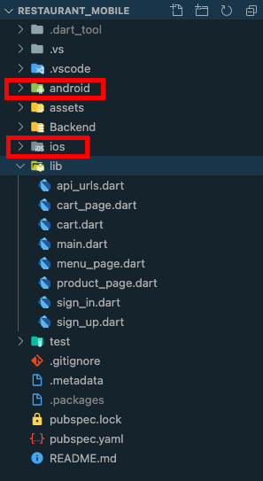
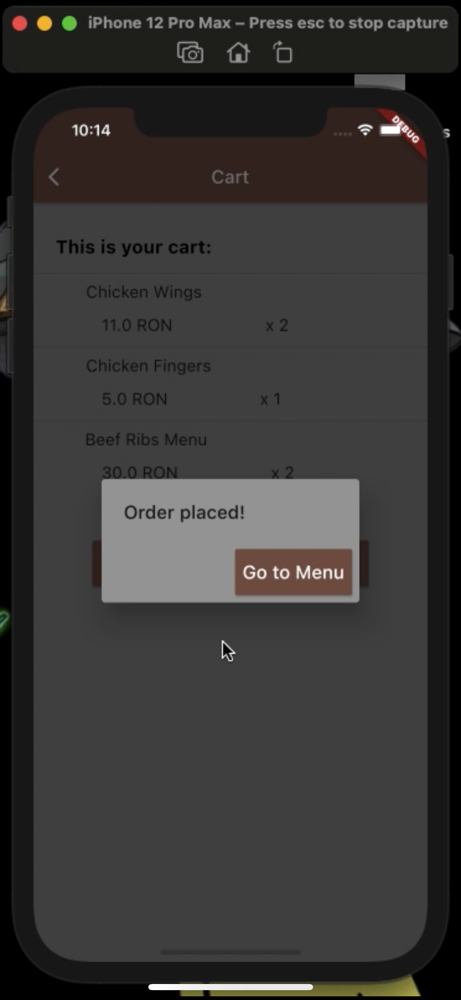

# Restaurant

This is an app for managing orders for a restaurant.

## Getting Started

A few resources to get you started with Flutter:

- [Lab: Write your first Flutter app](https://flutter.dev/docs/get-started/codelab)
- [Cookbook: Useful Flutter samples](https://flutter.dev/docs/cookbook)

For help getting started with Flutter, see the
[online documentation](https://flutter.dev/docs), which offers tutorials,
samples, guidance on mobile development, and a full API reference.

## One code-base

Flutter is Google’s UI toolkit for building beautiful, natively compiled applications for mobile, web, and desktop from a single codebase.

Flutter provides functionality to implement a mobile app for iOS and Android at the same time under the same code-base. You write code only once and it works for both operating systems.

## Widgets

Flutter widgets are built using a modern framework that takes inspiration from React. The central idea is that you build your UI out of widgets. Widgets describe what their view should look like given their current configuration and state. When a widget’s state changes, the widget rebuilds its description, which the framework diffs against the previous description in order to determine the minimal changes needed in the underlying render tree to transition from one state to the next.

## App presentation

A video demo of this app is also available on my [drive](https://drive.google.com/file/d/1b3JS6nJXDf8fuYzoJbgx-qrNTa3kKrXp/view?usp=sharing).

In this demo I've shown all functionalities on an iOS simulator, an Android emulator and also live on my iPhone. To be mentioned that this video is made in Romanian.

### Authentication
 
Like any other app on the market, we need a layer of authentication. SteakHouse app gives user the opportunity to create an account and also to login in an existing one.

|||||
|:---:|:---:|:---:|:---:|

### Menu

Once signed in, the user can see the menu; they can choose a category from the left menu or can tap on a product to see more details and eventually to add it to the cart.

||||
|:---:|:---:|:---:|
||||

### Cart and ordering

The user added all they want to the cart so now they can choose to see the cart when adding a product or when in menu page tap on menu icon and select `See cart`. The cart will look like this and the user can place the order.

|||
|:---:|:---:|

## Database and API

The database I've used in this project is an old one, made by me last year(2020) for another project in SQL Server. [DatabaseRestaurantScript](./Backend/Restaurant/DatabaseRestaurantScript.sql) is a SQL script with which the database can be restored in SQL Server Management Studio.

The API is made in C# with ASP.NET and connects with the database using Entity Framework and do all the operations which are required in the backend. 

I have also used a Visual Studio extension for making the API visible on the internet so my Flutter app can connect to it and so it is not required to have a database on the mobile divice. This extension is called Conveyor and can be easly downloaded from the Extension Market on Visual Studio.

!!!
***For the Flutter app (SteakHouse Restaurant) to work it is required that the API to be running on a server (local or not)***
